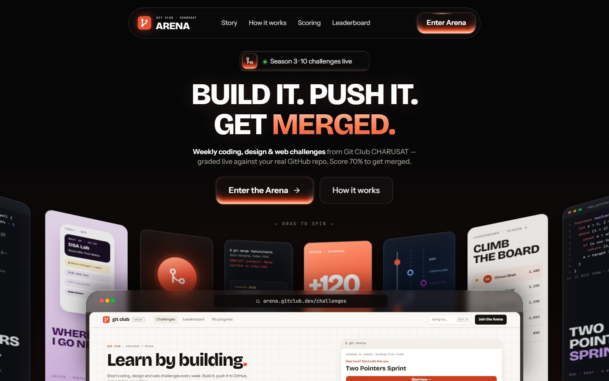

# Git Club Arena

**Learn by building.** A challenge platform for Git Club CHARUSAT: students pick a coding, design or web challenge, build it, push it to GitHub and earn XP when it is reviewed.

Built for the Git Club CHARUSAT Website Challenge — Problem Statement 4, *Challenge Arena*.



## The user journey

**Landing (`/`)** — a cinematic 3D front door: a rotating perspective ring of 37 Arena "posters" (drag or swipe to spin), a browser mock of the real Arena in front of it, a choreographed entrance, then the story, how it works, how scoring works and a final call to enter. The hero is authored on a fixed 1172 × 657 design canvas scaled to the viewport, with a tablet ramp and a genuine flow layout on phones.

**Arena (`/arena`)** → browse and filter challenges → open a challenge → **Start** → build it → **submit a GitHub repo** → live automated review → **approved** (XP, badges, new leaderboard rank) or **changes requested** (fix, push, run again).

A `git status`-style **Next up** card is always visible on the home page and profile, so a participant always knows what to do next.

## What makes it different

- **Real, per-challenge grading.** Every requirement has its own automated check that runs against the submitted repository: its commit history, file tree, file contents and README. *Resolve the Merge Conflict*, for example, looks for a real merge commit, scans every file for leftover `<<<<<<<` markers, reads the merge message and checks that `CONFLICTS.md` exists. Each requirement earns part of the points, partial work earns partial credit, and **70 % gets you merged**. Below that the status becomes *Changes requested* with the exact evidence for every miss; push a fix and run the review again.
- **Watch it happen.** The review streams into a terminal-style console — reading the repo, then each requirement turning pass / partial / fail with the proof it found and the marks earned.
- **Transparent before you start.** Every requirement shows, in plain English, what the review will look for.
- **No backend needed.** Reviews run in the browser: 3 requests to the public GitHub API (60/hour per network) plus file reads from `raw.githubusercontent.com`, pinned to the exact commit reviewed so a fresh push is never hidden by a cache.
- **Command palette.** `Ctrl/⌘ + K` opens a `$ git checkout …` prompt to jump to any challenge, page or action by keyboard.
- **Live from the club.** Club activity drawn as a `git log --graph` — starts, submissions and merges stream in, your own actions included. Pausable, and static for reduced-motion users.
- **Light "paper" and dark "terminal" themes.** Follows the system setting, remembers your choice, and never flashes the wrong theme on load.
- **Mobile-first details.** Bottom tab bar, a sticky action bar on challenge pages that steps aside when the same button is already visible, and 44 px touch targets.
- **Animated leaderboard climb.** After a submission is merged, the leaderboard replays your old position and slides your row to the new one, then tells you how many XP separate you from the next person.
- **Git as the design language.** Levels go from *Initial Commit* to *Core Maintainer*, badges include *First Merge* and *Green Pipeline*, activity is a contribution grid, and the 404 page is a failed `git checkout`.
- **Dates are relative to today**, so live challenges stay live whenever the site is opened.
- **Lazy onboarding.** Browsing needs no sign-up; name, year and branch are asked for only when you start your first challenge.

## Features

| Requirement | Where |
| --- | --- |
| Challenge listing with title, category, difficulty, deadline, points | Home page grid |
| Active / Upcoming / Completed distinction | Tabs with live counts |
| Search, category, difficulty filters and sorting | Home page — synced to the URL, `/` focuses search |
| Detail page with problem, requirements, rules, submission action | `/challenges/:slug` |
| Submission flow and statuses (Not started → In progress → Submitted → Changes requested / Completed) | Detail page — real automated review |
| Leaderboard | `/leaderboard`, filter by year |
| Progress dashboard, XP, levels, badges, streak | `/me` |
| Add to calendar (Google Calendar or `.ics`) | Upcoming and in-progress challenges |
| Responsive layout | Bottom tab bar on mobile, sticky sidebar on desktop |

## Tech

React 19 · TypeScript · Vite · Tailwind CSS v4 · React Router · Motion · Lucide icons · Firebase (Authentication + Firestore). Challenge data lives in `src/data/`; progress is saved per account in Firestore and cached in the browser.

## Getting started

Requires Node.js 22.12 or newer.

```bash
git clone https://github.com/kismats1107-stack/git-club-arena.git
cd git-club-arena
npm install
cp .env.example .env.local   # then fill in your Firebase web config
```

Without `.env.local` the app still runs, in a clearly labelled demo mode (one local account per browser).

## Usage

```bash
npm run dev       # development server at http://localhost:5173
npm run build     # type-check and build to dist/
npm run preview   # serve the production build at http://localhost:4173
npm run lint      # oxlint
```

Deployed on Vercel: `vercel.json` pins the build settings and routes every path to the app so deep links survive a refresh (`public/_redirects` does the same on Netlify).

## Accounts and security

Sign-in uses **Firebase Authentication** with **Google** and **GitHub** (OAuth — the Arena never sees or stores a password).

1. **Sign in / Create account** — one dialog, two providers.
2. **Complete your profile** (first time only) — CHARUSAT email (`…@charusat.edu.in`, required), name, year and branch. Year and branch are read from the college ID (`25CS099` → 2nd year, CSE). Signing in with a `@charusat.edu.in` Google account locks the email and marks it **Verified**.
3. Progress is saved per account in **Firestore** (`users/{uid}`, readable only by its owner) and cached locally; a public `leaderboard/{uid}` row puts real builders on the board. Rules: [`firestore.rules`](firestore.rules).

Without Firebase keys the app runs in a clearly labelled **demo mode** (one local account per browser), so nothing breaks before setup.

### Firebase setup (≈10 minutes)

1. [Firebase console](https://console.firebase.google.com) → **Create a project**.
2. **Authentication → Sign-in method** → enable **Google**. Enable **GitHub**: copy the callback URL Firebase shows, create a GitHub OAuth App (GitHub → Settings → Developer settings → OAuth Apps) with that callback URL, then paste its Client ID and secret back into Firebase.
3. **Authentication → Settings → Authorized domains** → add your deployed domain (e.g. `git-club-arena.vercel.app`).
4. **Firestore Database** → create (production mode) → **Rules** → paste `firestore.rules` → Publish.
5. **Project settings → Your apps → Web** → copy the config into `.env.local` (see `.env.example`) and into Vercel → Settings → Environment Variables.

## Adding a challenge

Add an entry to `src/data/challenges.ts`. `opens` and `closes` are `[days from today, hour]`. Each requirement pairs the text students read with a `rule` the review runs (`file`, `files`, `readme`, `content`, `eachFile`, `noContent`, `commits`, `mergeCommit`, `mergeMessage`, `commitMessages`, `linearHistory`, `liveUrl` — see `src/data/types.ts`); the engine lives in `src/lib/review.ts`. Club members can also propose one through the **Propose a challenge** link in the footer, which opens a pre-filled GitHub issue once `GITHUB_REPO_URL` is set in `src/config.ts`.
